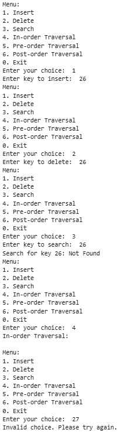
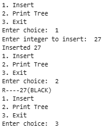
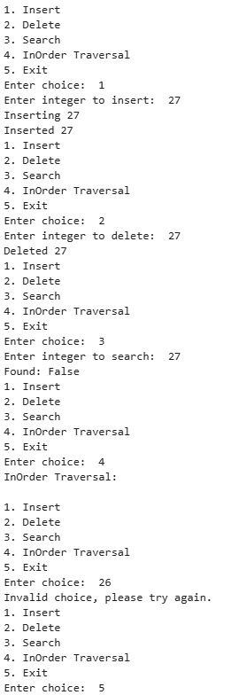

# HandsOn_8

# Problem 1

* Code for The basic Binary Search Tree is given [`BinarySearchTree.py`](BinarySearchTree.py)

 
<b>Output:</b>

 
 

# Problem 2

*  Code for RedBlack Tree is given [`RedBlackTree.py`](RedBlackTree.py)
 

<b>Output:</b>

# Problem 3

*  Code for AVL Tree is given [`AVLTree.py`](AVLTree.py)
 

<b>Output:</b>

